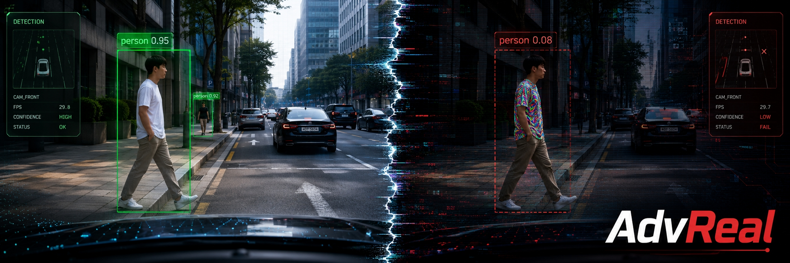
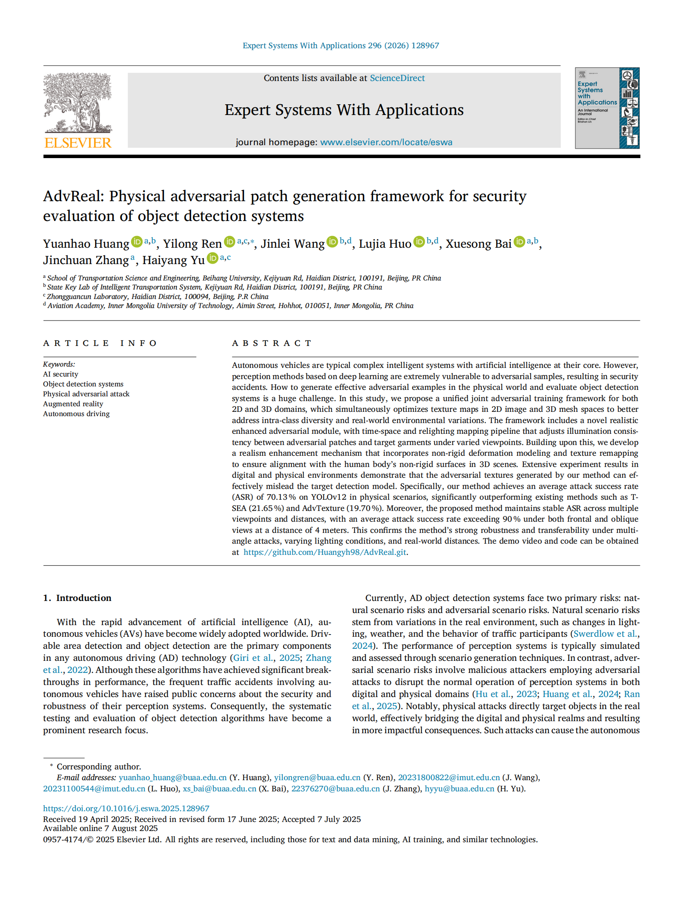
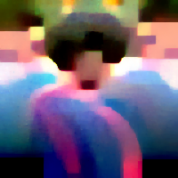
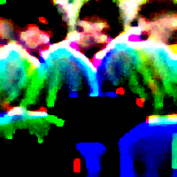
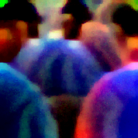
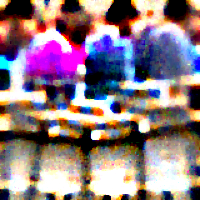
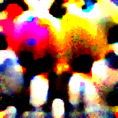

<p align="center">
  
</p>

<p align="center">
  <b>Physical adversarial patches that break object detectors in the real world.</b>
</p>

<p align="center">
    <a href="https://doi.org/10.1016/j.eswa.2025.128967"></a>
    <a href="https://arxiv.org/abs/2505.16402"></a>
    <a href="https://doi.org/10.1016/j.eswa.2025.128967"></a>
</p>

## 🔥 What is AdvReal?

Deep-learning-based object detectors powering autonomous vehicles are dangerously vulnerable to **physical adversarial patches** — carefully crafted textures that, when printed and placed in the real world, cause detectors to completely miss pedestrians, vehicles, and other critical objects.

**AdvReal** tackles this problem head-on. It proposes a **unified 2D-3D joint adversarial training framework** that generates adversarial patches robust enough to fool detectors under multi-angle viewing, varying lighting conditions, and different distances. By introducing **Non-Rigid Surface Modeling (NRSM)** and a **realistic 3D matching mechanism**, AdvReal bridges the critical sim-to-real gap that plagues existing methods.

> **AdvReal: Physical adversarial patch generation framework for security evaluation of object detection systems** <br> *Expert Systems with Applications*, Volume 296, 2026, Elsevier <br> [Paper](https://doi.org/10.1016/j.eswa.2025.128967) | [arXiv](https://arxiv.org/abs/2505.16402) <br> [Yuanhao Huang](https://github.com/Huangyh98), Yilong Ren, Jinlei Wang, Lujia Huo, Xuesong Bai, Jinchuan Zhang, Haiyang Yu

---

## 💡 How It Works

<p align="center">
  
</p>

AdvReal operates through a carefully designed pipeline:

1. **2D Adversarial Branch** — The patch is applied directly to 2D training images with random transformations (jitter, rotation, median pool, cutout), ensuring digital robustness against perturbations.

2. **3D Rendering Branch** — The patch is mapped as a UV texture onto 3D human mesh models (body, t-shirt, trousers), rendered from random camera angles with **randomized lighting** (ambient + directional + point lights), and composited into real NuScenes background images — simulating exactly how the patch would appear in the physical world.

3. **Non-Rigid Surface Modeling (NRSM)** — Thin Plate Spline (TPS) warping with curvature-aware control points realistically deforms clothing meshes during rendering, addressing the fundamental discrepancy between flat patches and real fabric surfaces with folds and wrinkles.

4. **Joint Optimization** — Both branches share the same adversarial patch tensor. The total loss combines detection loss from both pipelines with total variation regularization, producing patches that are simultaneously robust in digital and physical domains.

---

## 💥 Key Results

<div align="center">
  <table>
    <tr>
      <td width="33%" align="center">
        <b>🥇 Strongest Attack</b><br><br>
        <sub>Outperforms 5 state-of-the-art adversarial patch methods across 8 object detectors, achieving the lowest mAP drops on both single-stage and transformer-based architectures.</sub>
      </td>
      <td width="33%" align="center">
        <b>🔄 Cross-Detector Transfer</b><br><br>
        <sub>Patches trained on one detector effectively transfer to unseen detectors — including newer architectures like YOLOv11 and YOLOv12 that were never seen during training.</sub>
      </td>
      <td width="33%" align="center">
        <b>🚗 Real-World Validated</b><br><br>
        <sub>Successfully tested on a <b>Tesla Model-Y</b> dashboard camera. The adversarial texture fools the vehicle's perception system under multi-angle, varying lighting, and different distance conditions.</sub>
      </td>
    </tr>
  </table>
</div>

### 🎯 Full Detector Coverage

| Type | Detectors | Training | Evaluation |
|------|-----------|----------|------------|
| **Single-stage** | YOLOv2, YOLOv3, YOLOv5 | ✅ | ✅ |
| **Single-stage** | YOLOv8, YOLOv11, YOLOv12 | — | ✅ |
| **Two-stage** | Faster-RCNN | ✅ | ✅ |
| **Transformer** | D-DETR | ✅ | ✅ |

---

## 📹 Real-World Demo

https://github.com/user-attachments/assets/be833008-21f3-4604-aa1a-ca04e60f163f

<details>
<summary>🎬 Multi-angle attack & Tesla Model-Y test</summary>

### Multi-angle Robustness

https://github.com/user-attachments/assets/2fb20076-b603-4964-bc24-ac97a241a23b

https://github.com/user-attachments/assets/f8d46ab2-ef27-42fc-9813-88776f9340c6

### Tesla Model-Y Dashboard Camera Attack

https://github.com/user-attachments/assets/b95d507d-2414-4ac1-a195-432ee2172f3e

</details>

---

## 🚀 Quick Start

<details>
<summary>⚙️ Environment Setup</summary>

Tested on Ubuntu 20.04.6, Python 3.8.13, CUDA 11.7, PyTorch 1.13.1.

```shell
git clone https://github.com/Huangyh98/AdvReal.git
cd AdvReal
conda create -n advreal python=3.8 -y && conda activate advreal
pip install -r requirements.txt
pip install torch==1.13.1+cu117 torchvision==0.14.1+cu117 --extra-index-url https://download.pytorch.org/whl/cu117
pip install 'git+https://github.com/facebookresearch/pytorch3d.git@v0.6.2'
```

</details>

<details>
<summary>📦 Download Data & Models</summary>

| Resource | Link | Destination |
|----------|------|-------------|
| Datasets (INRIA Person) | [Google Drive](https://drive.google.com/file/d/166N0qA8qGMSUby7EAqajfrlZeXoMrypf/view?usp=drive_link) | `data/` in project root |
| Pretrained Detectors | [Google Drive](https://drive.google.com/file/d/1EwAvmoieebM5yrBKuOlutRZDw3LHhq7x/view?usp=drive_link) | `detlib/` in project root |
| YOLOv2 Weights | [Google Drive](https://drive.google.com/file/d/1t4Sd-Jmy2WFlqNJhbouU0_a4KZFTN0Wn/view?usp=drive_link) | `yolo2/` |
| YOLOv3 Weights | Run `./arch/weights/download_weights.sh` | `arch/weights/` |

</details>

<details>
<summary>🎯 Training</summary>

```shell
# YOLOv2
python train.py --nepoch 800 --save_path 'results/yolov2' --arch "yolov2" --cfg configs/baseline/v2.yaml --seed_type fixed --loss_type max_iou

# YOLOv3
python train.py --nepoch 800 --save_path 'results/yolov3' --arch "yolov3" --cfg configs/baseline/v3.yaml --seed_type fixed --loss_type max_iou

# YOLOv5
python train.py --nepoch 800 --save_path 'results/yolov5' --arch "yolov5" --cfg configs/baseline/v5.yaml --seed_type fixed --loss_type max_iou

# Faster-RCNN
python train.py --nepoch 800 --save_path 'results/rcnn' --arch "rcnn" --cfg configs/baseline/faster_rcnn.yaml --seed_type fixed --loss_type max_iou

# D-DETR
python train.py --nepoch 800 --save_path 'results/ddetr' --arch "deformable-detr" --cfg configs/baseline/ddetr.yaml --seed_type fixed --loss_type max_iou
```

Or use the provided shell script:
```shell
bash scripts/train.sh <cuda_id>
```

</details>

<details>
<summary>📊 Evaluation</summary>

```shell
bash scripts/eval.sh <cuda_id>
```

This evaluates the adversarial patch against both COCO-80 (YOLO models) and COCO-91 (torchvision models).

</details>

<details>
<summary>🎯 Pretrained Adversarial Patches for Evaluation</summary>

We provide adversarial patches trained on 5 different detectors for direct evaluation:

<p align="center">
   &nbsp;&nbsp;
   &nbsp;&nbsp;
   &nbsp;&nbsp;
   &nbsp;&nbsp;
  
</p>

</details>

---

## 🛠️ Technical Details

<details>
<summary>🔧 Architecture Overview</summary>

```
AdvReal/
├── train.py              # Main entry: joint 2D-3D training loop
├── render.py             # 3D rendering pipeline (PyTorch3D)
├── NRSM.py               # Non-Rigid Surface Modeling (TPS deformer)
├── color_util.py         # Physical-world color transformation
├── mesh_utils.py         # Mesh utilities & UV mapping
├── pytorch3d_modify.py   # Modified PyTorch3D renderer with UV reprojection
├── load_data.py          # Datasets & loss extractors for all detectors
├── utils_camou.py        # YOLO detection utilities (NMS, bbox IoU)
├── attack/               # Adversarial attack framework
│   ├── attacker.py        #   UniversalAttacker: coordinates detect & attack
│   ├── methods/          #   PGD, BIM, MIM, optimizer-based attacks
│   └── uap/              #   Universal patch management & augmentation
├── arch/                 # Detector architectures (YOLOv3, pytorchyolo)
├── configs/              # YAML configs for each detector
├── utils/                # Metrics (mAP), solvers, data preprocessing
├── yolo2/                # YOLOv2 model
└── scripts/              # Train & eval shell scripts, demo
```

</details>

<details>
<summary>📖 Attack Methods</summary>

AdvReal supports multiple attack optimization strategies:

| Method | Class | Description |
|--------|-------|-------------|
| **Optimizer-based** | `optim` | Adam optimizer with amsgrad for direct patch optimization |
| **PGD** | `pgd` | Projected Gradient Descent with sign-based updates |
| **BIM** | `bim` | Basic Iterative Method with ε-clamped gradients |
| **MIM** | `mim` | Momentum Iterative FGSM with accumulated gradients |

Each method integrates with the joint 2D-3D pipeline and supports configurable loss functions (`obj-tv`, `max_iou`, etc.) and learning rate schedulers (ALRS, Cosine, Plateau).

</details>

<details>
<summary>🔧 NRSM Details</summary>

Non-Rigid Surface Modeling uses **Thin Plate Spline (TPS) warping** to simulate realistic clothing deformation:

1. **Curvature computation** — Vertex curvatures are estimated from adjacent face normals
2. **Control point selection** — High-curvature regions receive more control points via MiniBatchKMeans clustering (200 points)
3. **TPS matrix pre-computation** — Inverse kernel and target representation matrices are pre-computed for efficient per-frame deformation
4. **Random deformation** — During training, random displacements are applied to control points and propagated to all mesh vertices via TPS

This ensures adversarial textures are tested under realistic clothing deformation rather than static 3D models.

</details>

---

## 🙏 Acknowledgments

Built upon [T-SEA](https://github.com/VDIGPKU/T-SEA) and [Adv-CaT](https://github.com/WhoTHU/Adversarial_camou). We extend our gratitude to the authors for their contributions.

## 📝 Citation

```bibtex
@article{huang2026advreal,
  title={AdvReal: Physical adversarial patch generation framework for security evaluation of object detection systems},
  author={Huang, Yuanhao and Ren, Yilong and Wang, Jinlei and Huo, Lujia and Bai, Xuesong and Zhang, Jinchuan and Yu, Haiyang},
  journal={Expert Systems with Applications},
  volume={296},
  pages={128967},
  year={2026},
  publisher={Elsevier}
}
```
