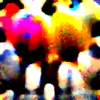

# AdvReal
## AdvReal: AdvReal: Physical adversarial patch generation framework for security evaluation of object detection systems

This is the official repository for the paper:

[AdvReal: Physical adversarial patch generation framework for security evaluation of object detection systems](https://doi.org/10.1016/j.eswa.2025.128967).


## Abstract
Autonomous vehicles are typical complex intelligent systems with artificial intelligence at their core. However, perception methods based on deep learning are extremely vulnerable to adversarial samples, resulting in safety accidents. How to generate effective adversarial examples in the physical world and evaluate object detection systems is a huge challenge. In this study, we propose a unified joint adversarial training framework for both 2D and 3D samples to address the challenges of intra-class diversity and environmental variations in real-world scenarios. Building upon this framework, we introduce an adversarial sample reality enhancement approach that incorporates non-rigid surface modeling and a realistic 3D matching mechanism. We compare with 5 advanced adversarial patches and evaluate their attack performance on 8 object detecotrs, including single-stage, two-stage, and transformer-based models. Extensive experiment results in digital and physical environments demonstrate that the adversarial textures generated by our method can effectively mislead the target detection model. Moreover, proposed method demonstrates excellent robustness and transferability under multi-angle attacks, varying lighting conditions, and different distance in the physical world. 

https://github.com/user-attachments/assets/be833008-21f3-4604-aa1a-ca04e60f163f

## Quick Start

### 1. Requirements
All the codes are tested in the following environment:
* Linux (Ubuntu 20.04.6)
* Python 3.8.13
* CUDA 11.7
* PyTorch 1.13.1
* Numpy 1.22.4
* Torchvision 0.14.1
* pytorch3d 0.6.2
* TensorboardX 2.10.1
* Tqdm 4.66.4
* Easydict 1.13

### 2. Preparation
The data are shared by [Google Drive](https://drive.google.com/file/d/166N0qA8qGMSUby7EAqajfrlZeXoMrypf/view?usp=drive_link). You need to download it and place the *data* folder in the root directory of this project. 
```
https://drive.google.com/file/d/1nfmIO8ZNNh730RUaqTzyB8Qh8oJZVp27/view?usp=drive_link
```

The model are shared by [Google Drive](https://drive.google.com/file/d/1EwAvmoieebM5yrBKuOlutRZDw3LHhq7x/view?usp=drive_link). You need to download it and place the *detlib* folder in the root directory of this project. 

```
[https://drive.google.com/file/d/1nfmIO8ZNNh730RUaqTzyB8Qh8oJZVp27/view?usp=drive_link](https://drive.google.com/file/d/12LHfxYsWwepFuApFA56OygWpfI-cxv0m/view?usp=drive_link)
```


If you are going to use yolov3, you need to download its weights by running
```
./arch/weights/download_weights.sh
```
### 3. Train
We provide the command to optimize AdvReal for different target detectors.

##### YOLOv2
```
python train.py --nepoch 800 --save_path 'results/yolov2' --arch "yolov2" --cfg configs/baseline/v2.yaml --seed_type fixed --loss_type max_iou
```
##### YOLOv3
```
python train.py --nepoch 800 --save_path 'results/yolov3' --arch "yolov3" --cfg configs/baseline/v3.yaml --seed_type fixed --loss_type max_iou
```
##### YOLOv5
```
python train.py --nepoch 800 --save_path 'results/yolov5' --arch "yolov5" --cfg configs/baseline/v5.yaml --seed_type fixed --loss_type max_iou
```
##### Faster-RCNN
```
python train.py --nepoch 800 --save_path 'results/rcnn' --arch "rcnn" --cfg configs/baseline/faster_rcnn.yaml --seed_type fixed --loss_type max_iou
```
##### D-DETR
```
python train.py --nepoch 800 --save_path 'results/ddetr' --arch "deformable-detr" --cfg configs/baseline/ddetr.yaml --seed_type fixed --loss_type max_iou
```

## Patches that can be used for comparative testing

### AdvReal (YOLO-v2)


### AdvReal (YOLO-v3)


### AdvReal (YOLO-v5)


### AdvReal (Faster-RCNN)


### AdvReal (D-DETR)




## Acknowledge
Our code is built based on [T-SEA](https://github.com/VDIGPKU/T-SEA) and [Adv-CaT](https://github.com/WhoTHU/Adversarial_camou).


## Demonstration of attack effects

https://github.com/user-attachments/assets/2fb20076-b603-4964-bc24-ac97a241a23b

## Demonstration of multi-angle attack effect

https://github.com/user-attachments/assets/f8d46ab2-ef27-42fc-9813-88776f9340c6

## Attack object detection system of  Tesla Model-Y

https://github.com/user-attachments/assets/b95d507d-2414-4ac1-a195-432ee2172f3e

## Cite this
If our work is helpful to your research or publication, we kindly ask that you cite our paper as follows:
```
@article{huang2026advreal,
  title={AdvReal: Physical adversarial patch generation framework for security evaluation of object detection systems},
  author={Huang, Yuanhao and Ren, Yilong and Wang, Jinlei and Huo, Lujia and Bai, Xuesong and Zhang, Jinchuan and Yu, Haiyang},
  journal={Expert Systems with Applications},
  volume={296},
  pages={128967},
  year={2026},
  publisher={Elsevier}
}
```
